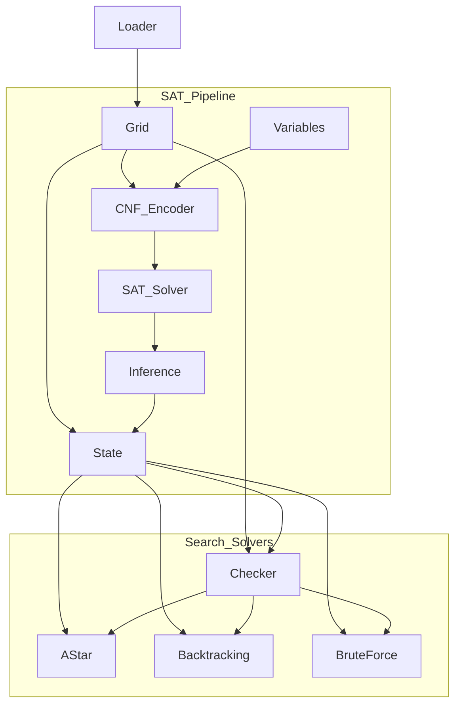

# Code Explanation Guide

This directory contains detailed documentation for the Hashiwokakero solver codebase. The modules are designed to work together in a layered architecture.

## Recommended Reading Order

To understand the system from the ground up, we recommend reading the documentation in the following order:

### 1. Core Data Structures (The Foundation)
Start here to understand how the puzzle is represented in memory.
- **[loader.md](loader.md)**: How the raw text input is parsed.
- **[grid.md](grid.md)**: The static topology of the board (Islands and Corridors).
- **[state.md](state.md)**: The dynamic state of the game (placed bridges, remaining degrees).
- **[checker.md](checker.md)**: The rules engine that validates moves (no crossings, degree limits).

### 2. SAT Solver Pipeline (The Logic Engine)
Next, see how the problem is translated into logic for the SAT solver.
- **[variables.md](variables.md)**: How game concepts map to integer variables.
- **[cnf_encoder.md](cnf_encoder.md)**: How game rules are converted into CNF clauses.
- **[inference.md](inference.md)**: How SAT results are decoded back into a game state.
- **[sat_solver.md](sat_solver.md)**: The high-level solver that orchestrates the SAT process and handles connectivity.

### 3. Search Algorithms (The Alternatives)
Finally, explore the alternative solving strategies used for benchmarking.
- **[solvers.md](solvers.md)**: Covers A*, Backtracking, and Brute-Force implementations.

## Module Dependency Graph

